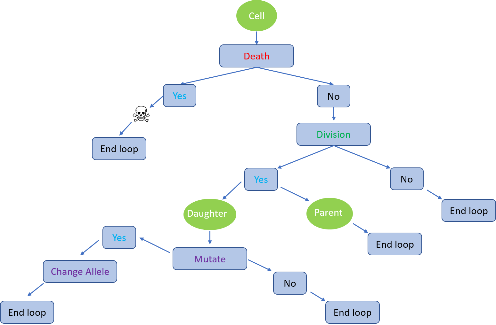

# Agent-based model of evolution in asexually reproducing populations

For more details about the model and the implementation see the file `abm_description.pdf`

## ABM model flow chart

## How to use
See the `abm_demo.ipynb` for demonstration

### Dependencies

This script depends on the following libraries:

* numpy, matplotlib, scipy
* networkx
* seaborn
* moviepy
